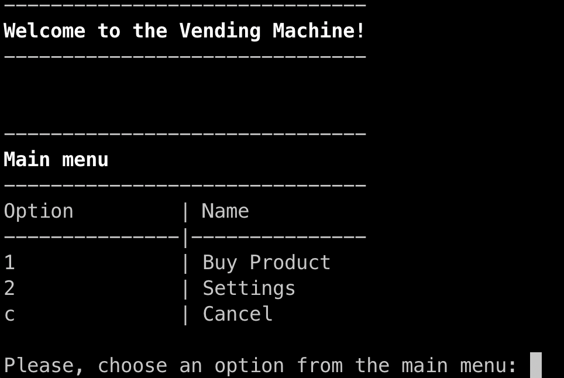
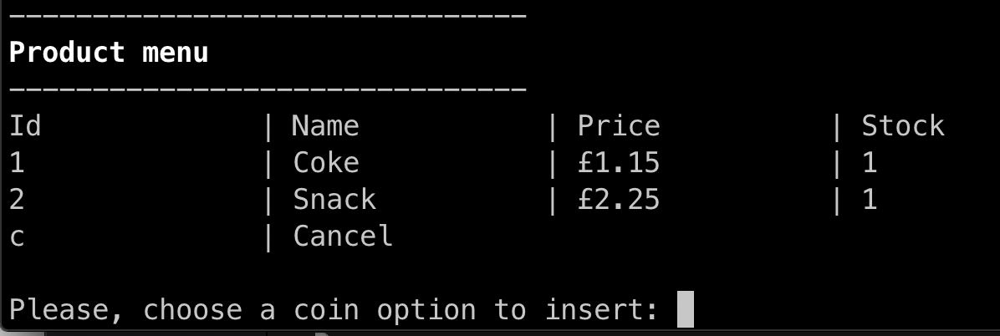

# Vending Machine Execise

This is a simple vending machine script with the folowing use cases

* Once an item is selected and the appropriate amount of money is inserted, the vending machine should return the correct product.
* It should also return change if too much money is provided, or ask for more money if insufficient funds have been inserted.
* The machine should take an initial load of products and change. The change will be of denominations 1p, 2p, 5p, 10p, 20p, 50p, £1, £2. There should be a way of reloading either products or change at a later point.
* The machine should keep track of the products and change that it contains.

## Running with docker compose

```
docker-compose run machine
```
## Screenshots

#### Welcome screen



#### Products Menu




#### Insert coins


#### Settings menu


#### Machine state


### Sample data

**Products**

```
./data/products.csv
```

**Coins**

```
./data/coins.csv
```


### Running

Requirement

* elixir 1.11

Install the dependencies:

```bash
mix deps.get
```

Run the machine with the following code

```bash
mix machine start
```

Testing

```bash
mix test
```


